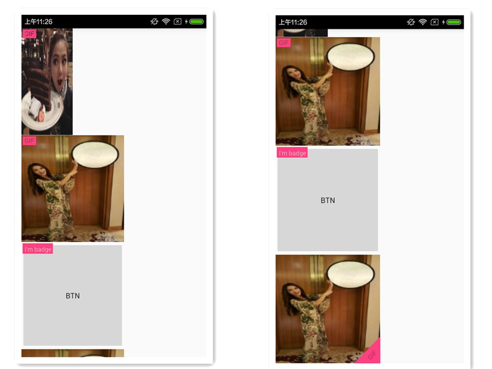

# BadgedView

[English Version](README_ENGLISH.md)

BadgedView 能够为任意一个 View 添加矩形或三角形标签。

BadgedImageView 就是 [Plaid](https://github.com/nickbutcher/plaid) 和 [虎扑体育](http://mobile.hupu.com/?_r=globalNav) 用来给图片添加标签的控件。原作者的实现里，只能为 ImageView 添加 Badge，我看了看他的代码（[开源](https://github.com/yesidlazaro/BadgedImageview)）发现这个控件其实蛮简单的，想法挺好，但是代码写的不是特别好。而且我觉得应该能将这个控件应用到任意一个 View 上边，所以我根据我的想法实现了 BadgedView。

效果图：



#Feature

## Implemented

- 设置标签内的文字
- 设置标签背景颜色
- 自定义标签形状、文字
- 将标签应用于任意 View
- 可在标签所在布局设置长宽比例
- 设置矩形标签或三角形标签在视图中的位置

## Processing

- 用图片作为标签
- 不需要实现子类就能为每一个 View 添加任意多的标签
- 不需要修改布局文件，直接调用 BadgedView.attach(View v) 即可完成标签添加

#Usage

##Dependency

###Min SDK：2.3.3

###Add Dependency

在项目的 build.gradle 里添加：

```
dependencies {
    ...
    compile ('com.github.chaossss:BadgedView:1.0.1')
}
```

##Attr

| Attr | usage |
|---------|--------|
| app:badgeText | 设置标签中显示的文字 |
| app:badgeTextSize | 设置标签中显示的文字大小 |
| app:badgeTextColor | 设置标签中显示的文字颜色 |
| app:badgePadding | 设置标签中文字和标签边界的间距 |
| app:badgeWidthRatio | 设置标签布局的长宽比 |
| app:badgeHeightRatio | 设置标签布局的长宽比 |
| app:badgeCornerRadius | 设置矩形标签圆角的半径 |
| app:recbadgeGravity(RecBadgedView) | 设置矩形标签的位置 |
| app:tribadgeGravity(TriBadgedView) | 设置三角标签的位置 |

##API

| API | usage |
|---------|--------|
| showBadge(boolean show) | 显示标签 |
| setBadgeText(String newText) | 设置标签显示文字 |

##Customize BadgedView

1. 继承 BadgedView，父类 BadgedView 已经有了标签常用的属性
2. 在子类添加你所需要的特定的属性域
3. 重写 initBadge(Context context) 和 draw(Canvas canvas) 方法以实现你的需求

如果需要自定义标签：

4. 继承 BaseBadge
5. 在子类添加你所需要的特定的属性域
6. 重写 initBadge()，在其中对 badge 完成你所需要的标签的绘制工作

##Activity

```java
public class MainActivity extends AppCompatActivity implements View.OnClickListener {
    private RecBadgedView anyView;
    private RecBadgedView scaleView;
    private RecBadgedView regularView;

    private TriBadgedView triView;

    @Override
    protected void onCreate(Bundle savedInstanceState) {
        super.onCreate(savedInstanceState);
        setContentView(R.layout.activity_main);

        anyView = (RecBadgedView) findViewById(R.id.badge_any_view);
        scaleView = (RecBadgedView) findViewById(R.id.badge_scale_view);
        regularView = (RecBadgedView) findViewById(R.id.badge_regular_view);

        triView = (TriBadgedView) findViewById(R.id.badge_tri_view);

        anyView.setBadgeText("I'm badge");
        anyView.setOnClickListener(this);
        anyView.showBadge(true);

        scaleView.showBadge(true);
        regularView.showBadge(true);

        triView.showBadge(true);
    }

    @Override
    public void onClick(View v) {
        if(anyView.isBadgeVisible()){
            anyView.showBadge(false);
        } else {
            anyView.showBadge(true);
        }
    }
}
```

##XML

```xml
<?xml version="1.0" encoding="utf-8"?>
<ScrollView xmlns:android="http://schemas.android.com/apk/res/android"
    xmlns:app="http://schemas.android.com/apk/res-auto"
    android:layout_width="match_parent"
    android:layout_height="match_parent"
    android:orientation="vertical">
    <LinearLayout
        android:layout_width="match_parent"
        android:layout_height="match_parent"
        android:orientation="vertical">
        <com.chaos.customview.badgeview.view.RecBadgedView
            android:id="@+id/badge_scale_view"
            android:layout_width="200dp"
            android:layout_height="200dp"
            android:foreground="?selectableItemBackground"
            app:recbadgeGravity="bottom|right"
            app:badgeWidthRatio="2"
            app:badgeHeightRatio="4"
            app:badgeColor="@color/colorAccent"
            app:badgeText="@string/lab_gif" >
            <ImageView
                android:layout_width="match_parent"
                android:layout_height="match_parent"
                android:scaleType="fitXY"
                android:src="@mipmap/gem"/>
        </com.chaos.customview.badgeview.view.RecBadgedView>

        <com.chaos.customview.badgeview.view.RecBadgedView
            android:id="@+id/badge_regular_view"
            android:layout_width="200dp"
            android:layout_height="200dp"
            android:foreground="?selectableItemBackground"
            app:badgeColor="@color/colorAccent"
            app:recbadgeGravity="bottom|left"
            app:badgeText="@string/lab_gif" >
            <ImageView
                android:layout_width="match_parent"
                android:layout_height="match_parent"
                android:scaleType="fitXY"
                android:src="@mipmap/hebe"/>
        </com.chaos.customview.badgeview.view.RecBadgedView>

        <com.chaos.customview.badgeview.view.RecBadgedView
            android:id="@+id/badge_any_view"
            android:layout_width="200dp"
            android:layout_height="200dp"
            android:foreground="?selectableItemBackground"
            app:recbadgeGravity="top|right"
            app:badgeText="@string/lab_gif" >
            <Button
                android:layout_width="match_parent"
                android:layout_height="match_parent"
                android:text="btn"/>
        </com.chaos.customview.badgeview.view.RecBadgedView>

        <com.chaos.customview.badgeview.view.TriBadgedView
            android:id="@+id/badge_tri_view"
            android:layout_width="200dp"
            android:layout_height="200dp"
            app:badgeText="@string/lab_gif">
            <ImageView
                android:layout_width="match_parent"
                android:layout_height="match_parent"
                android:scaleType="fitXY"
                android:src="@mipmap/hebe"/>
        </com.chaos.customview.badgeview.view.TriBadgedView>
    </LinearLayout>
</ScrollView>
```
